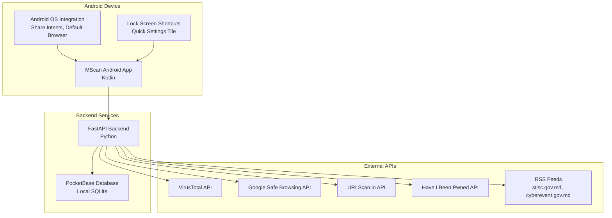

# MScan Security Module - Design Document

## Overview

MScan is a native Android cybersecurity application that provides comprehensive security scanning, threat intelligence, and incident reporting capabilities. The application follows a client-server architecture with a Kotlin Android frontend and a Python FastAPI backend, utilizing PocketBase for data persistence and external security APIs for threat detection.

## Architecture

### High-Level Architecture



### Technology Stack

**Frontend (Android):**
- Language: Kotlin
- UI Framework: Android Jetpack Compose
- Architecture: MVVM with Repository Pattern
- Networking: Retrofit2 with OkHttp
- Image Loading: Coil
- QR Code Scanning: ML Kit
- Local Storage: Room Database (for caching)

**Backend:**
- Framework: FastAPI (Python)
- Database: PocketBase (SQLite-based)
- HTTP Client: httpx (for async external API calls)
- RSS Parsing: feedparser
- Caching: In-memory with TTL

**Security:**
- HTTPS/TLS for all communications
- API key management via environment variables
- Input validation and sanitization
- GDPR-compliant data handling

## Components and Interfaces

### Android Application Components

#### 1. MainActivity
- **Purpose:** Host the main navigation and security fragment
- **Key Features:**
  - Bottom navigation bar integration
  - Fragment container management
  - Deep link handling

#### 2. SecurityFragment
- **Purpose:** Main security interface with scanning capabilities
- **Components:**
  - Scan input field with file upload button
  - Email breach check button with dialog
  - News feed RecyclerView (GridLayoutManager, 2 columns)
  - Report access via three-dot menu

#### 3. ReportFragment
- **Purpose:** Incident reporting interface
- **Components:**
  - Problem type spinner
  - Description EditText
  - Screenshot upload button
  - Email field
  - Submit button

#### 4. Share Intent Handlers
- **ScanIntentActivity:** Handles "Scan with MScan" shares
- **ReportIntentActivity:** Handles "Report with MScan" shares
- **BrowserInterceptActivity:** Handles default browser functionality

#### 5. Lock Screen Integration
- **QuickScanTileService:** Quick Settings tile for camera scanning
- **CameraScanActivity:** Dedicated QR code/text scanning interface

### Backend API Components

#### 1. Scan Service (`/scan`)
```python
class ScanService:
    async def scan_content(self, content: Union[str, bytes]) -> ScanResult
    async def aggregate_results(self, api_responses: List[dict]) -> str
    async def log_scan(self, scan_data: dict) -> None
```

#### 2. Email Breach Service (`/scan/email`)
```python
class EmailBreachService:
    async def check_email_breaches(self, email: str) -> BreachResult
    async def log_email_check(self, check_data: dict) -> None
```

#### 3. News Service (`/news`)
```python
class NewsService:
    async def fetch_rss_feeds(self) -> List[Article]
    def cache_articles(self, articles: List[Article]) -> None
    def get_cached_articles(self) -> Optional[List[Article]]
```

#### 4. Report Service (`/report`)
```python
class ReportService:
    async def save_report(self, report_data: dict) -> str
    def validate_report_data(self, data: dict) -> bool
```

## Data Models

### Android Data Models

```kotlin
data class ScanResult(
    val verdict: String, // "safe", "suspicious", "malicious"
    val details: String,
    val timestamp: Long
)

data class Article(
    val title: String,
    val link: String,
    val imageUrl: String?,
    val publishDate: String
)

data class BreachResult(
    val isPwned: Boolean,
    val breaches: List<String>
)

data class Report(
    val type: String,
    val description: String,
    val screenshotBase64: String?,
    val email: String?
)
```

### PocketBase Collections Schema

#### scans Collection
```json
{
  "id": "string (PK)",
  "timestamp": "datetime",
  "item_type": "string", // "file", "url", "text"
  "item_hash_or_url": "string",
  "verdict": "string", // "safe", "suspicious", "malicious"
  "api_responses": "json", // Raw responses from external APIs
  "processing_time_ms": "number"
}
```

#### email_checks Collection
```json
{
  "id": "string (PK)",
  "timestamp": "datetime",
  "email_hash": "string", // SHA-256 hash for privacy
  "is_pwned": "boolean",
  "breach_count": "number",
  "breach_names": "json"
}
```

#### reports Collection
```json
{
  "id": "string (PK)",
  "timestamp": "datetime",
  "report_type": "string",
  "description": "text",
  "attachment_hash": "string", // SHA-256 of screenshot
  "source_item": "string", // The reported URL/file identifier
  "user_email": "string" // Optional, for follow-up
}
```

## Error Handling

### Android Error Handling
- **Network Errors:** Retry mechanism with exponential backoff
- **API Failures:** Graceful degradation (show partial results if available)
- **File Access Errors:** User-friendly error messages with suggested actions
- **Permission Errors:** Clear permission request dialogs with explanations

### Backend Error Handling
- **External API Failures:** Continue with available API results, log failures
- **Rate Limiting:** Implement request queuing and user notification
- **Database Errors:** Automatic retry with fallback to in-memory storage
- **Input Validation:** Comprehensive validation with detailed error responses

### Error Response Format
```json
{
  "error": true,
  "message": "User-friendly error message",
  "code": "ERROR_CODE",
  "details": "Technical details for debugging"
}
```

## Testing Strategy

### Android Testing
1. **Unit Tests:**
   - Repository layer tests
   - ViewModel logic tests
   - Utility function tests
   - Data model validation tests

2. **Integration Tests:**
   - API communication tests
   - Database operations tests
   - Share intent handling tests

3. **UI Tests:**
   - Fragment navigation tests
   - User interaction flow tests
   - Accessibility tests

### Backend Testing
1. **Unit Tests:**
   - Service layer tests
   - Data validation tests
   - External API integration tests (mocked)

2. **Integration Tests:**
   - End-to-end API tests
   - PocketBase integration tests
   - External API integration tests (with test keys)

3. **Performance Tests:**
   - Load testing for concurrent scans
   - Response time benchmarks
   - Memory usage profiling

### Security Testing
1. **Input Validation Testing:**
   - Malicious file upload attempts
   - SQL injection attempts
   - XSS prevention tests

2. **API Security Testing:**
   - Authentication bypass attempts
   - Rate limiting validation
   - Data exposure tests

3. **Privacy Compliance Testing:**
   - PII detection and removal verification
   - Data retention policy compliance
   - GDPR compliance validation

## Security Considerations

### Data Protection
- No PII storage beyond necessary report information
- Email addresses hashed using SHA-256 before storage
- Screenshots stored as hashes with secure deletion policies
- API keys stored in secure environment variables

### Communication Security
- All external communications over HTTPS/TLS 1.3
- Certificate pinning for critical API endpoints
- Request/response validation and sanitization
- Rate limiting to prevent abuse

### Android Security
- ProGuard/R8 code obfuscation
- Root detection and warning
- Secure file storage using Android Keystore
- Runtime Application Self-Protection (RASP) techniques

### Compliance
- GDPR Article 25 (Data Protection by Design)
- Government security standards compliance
- Regular security audits and penetration testing
- Incident response procedures